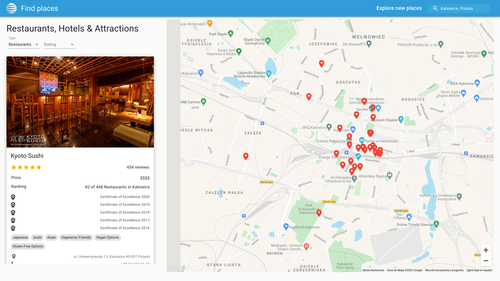

# Find places app

> Find restaurants, hotels and interesting attractions anywhere in the world. 

> Live demo [https://find-places-app.netlify.app/](https://find-places-app.netlify.app/).

## Table of Contents

- [General info](#general-info)
- [Technologies](#technologies)
- [Setup](#setup)

## General info

This projects is created with React and it uses Travel Advisor API & Google API. With this app user can find best restaurants, hotels & attractions anyhere in the world. 

## Technologies

Project is created with:

- React
- Material UI
- Travel Advisor API (Rapidapi.com)
- Places API (google)
- Maps Javascript API (google)

## Features

User can:
- find restaurants, hotels & attractions in a location taken from his geolocation
- get most important information about this places
- search for new places anywhere in the world
- filtering places by type and rating

## Acknowledgements

This project was based on this [Tutorial](https://www.youtube.com/watch?v=GDa8kZLNhJ4).

## Contact

Created by [@jakubparlej](https://jprojects.pl) - feel free to contact me!
